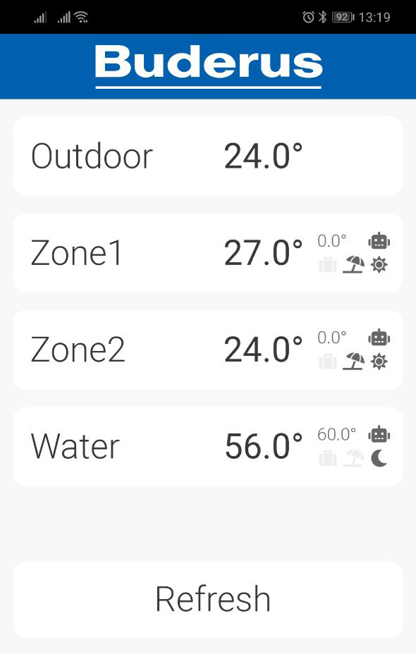

# Buderus Logamax 4xxx monitor

> This project is inspired by [Peter Holzleitner](https://holzleitner.com/el/buderus-monitor/index-en.html).

This stuff allows you to monitor your Buderus boiler with Logamatic 4xxx from your smartphone or laptop.
Server side runs on a Raspberry Pi, client side runs on any web browser on in a Telegram app.

Unfortunately, Logamatic 4xxx does not have IO port compatible to Raspberry Pi, so you have to assemble a simple connector.

The `schematic.png` shows how it is supposed to be implemented.


The pins are used on Raspberry Pi:
* __+3.3V__ (pins 1 or 17)
* __RXD0__ (GPIO15, pin 10)
* __Ground__ (pins 6, 9, 14, 20, 25, 30, 34, or 39)

The `BF` pins are used on Logamatic 4xxx. Check out your Logamatic 4xxx docs for it's location.

#### Installing

*I mean that Nodejs has been installed and configured already.*

First, download release zip archive and extract it's files anywhere on your Raspberry Pi. Then install needed Nodejs modules
```
npm install
```
Done!

#### Configuring

The `config.json` provides all required settings as a JSON object:
* `portName` is a device name of Raspberry Pi's serial port
* The `web` field describes web server configuration
    * `allowedIP` is an array of allowed IP addresses/masks. Remove it if your do not require IP filtering. [More info](https://www.npmjs.com/package/express-ipfilter)
    * `port` number to listen at. Run code with `sudo` if `port 80` specified.
* The `telegram` field provides config for Telegram bot
    * `apikey` is obviously your Telergam bot's API key. [More info](https://core.telegram.org/bots)
    * `proxy` is an address or HTTP/HTTPS proxy server. Use it only if Telegram bots are blocked in your country. This overrides `baseApiUrl` bot option.
    * `phones` is an array or allowed Telegram IDs (not phone numbers).

The only required field is `portName`. Every other field is optional.

The are at least two reasons to configure Telegram bot here:
* World-wide safe remote access to your boiler without VPNs, static IPs, tunnels, port switches, etc.
* Bot will send you a notification immediately if any error occurs.

#### Running
```
nodejs index.js
```
or in case of port 80 (or any other system port)
```
sudo nodejs index.js
```
The best idea is to run this code as a Systemd service. Check out the `buderus-monitor.service` file for a sample configuration.

#### Accessing from web browser
```
http://<raspberry_ip>[:<port>]/
```
or
```
http://<raspberry_hostname>[:<port>]/
```
You also can turn this UI to a standalone app on any iOS or Android device.
Just use 'Add to main screen' option (or smth like that).

Here is how it should look like on a smartphone



#### Building from sources

Checkout from Github repository to your PC/Mac and run
```
npm install
npm run prod
```
By default, output directory is `./target`. You can change it in `webpackfile.js`